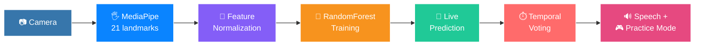

<div align="center">

# 🤟 SignSenseLive ✨

**Train your own real-time hand sign recognizer using a webcam - no pretrained sign-language dataset required.**


<br>

⭐ **If this project is useful to you, a star helps a lot!** ⭐

</div>

---

## 🗺️ Jump To

<div align="center">

| 🌟 | 🧠 | 🎮 | 🚀 | 📁 | 🛠 |
|:---:|:---:|:---:|:---:|:---:|:---:|
| [Highlights](#-highlights) | [How It Works](#-how-it-works) | [Controls](#-controls) | [Quick Start](#-quick-start) | [Project Layout](#-project-layout) | [Extending It](#️-extending-signsenselive) |

</div>

---

## 🌟 Highlights

<table>
<tr>
<td width="50%" valign="top">

### 🖐️ Real-Time Hand Tracking
21-point MediaPipe hand landmark tracking, normalized to be translation- and scale-invariant — hand placement and camera distance never affect accuracy, only the hand's *shape* does.

### 🌲 Train-It-Yourself Classifier
No pretrained sign-language dataset. A `RandomForestClassifier` trains on *your* collected signs in under a second on CPU — fast, explainable, and realistic for the few-hundred-samples-per-class datasets a webcam session actually produces.

### 🎯 Temporal-Smoothed Prediction
Raw per-frame predictions flicker on live video — that's normal, not a bug. Majority-vote smoothing across the last 8 frames debounces it into a stable, confident reading.

### 👐 Two-Handed Signs
A separate `--two-hand` mode captures both hands into a single 128-dim feature vector (63 shape dims per hand + a presence flag each), so an absent hand is never confused with one that just happens to sit near the normalized origin. Own dataset, own model file — the single-hand pipeline is untouched.

### 🌈 Animated Rainbow Skeleton
Every camera app draws a full hand skeleton — bone connections and joints colored per-finger (thumb→pinky sweeps crimson→orange→green→blue→violet) — instead of plain dots, with fingertips gently pulsing so it reads as alive, not static.

### 🎭 Theme Switcher
Press `T` to cycle **dark / light / neon / mono** palettes — every panel, badge, and skeleton accent re-skins live across all five camera apps.

### 🎬 Cinematic Vignette
A cached radial edge-darkening applied to every frame — cheap after the first frame at a given resolution, gives the camera feed a subtle "not just a raw webcam window" polish.

</td>
<td width="50%" valign="top">

### 🎮 Practice / Match Mode
A quiz mode that prompts a random sign, tracks your streak, accuracy, and reaction time — turns the project from a demo into something you can actually train yourself with.

### 🔊 Text-to-Speech Output
Every recognized sign is spoken aloud in `live` mode — non-blocking (a background thread + queue, so it never freezes the camera feed) and fails silently if no TTS voice is available.

### 📊 Confusion Matrix Dashboard
Every `train` run renders a heatmap showing exactly which signs get mixed up with which — overall accuracy hides that a model can be 90% accurate while two specific signs are nearly indistinguishable to it.

### 🏃 Motion-Based Signs
For signs that move (swipes, J/Z-style letters) rather than hold a pose: `collect_motion` records a short clip, and hand-engineered trajectory features (start/mid/end hand shape, net displacement, path length, a straightness ratio) summarize it into one sample — no recurrent model, no sequence-length headaches, still trains on a laptop CPU.

### ✨ Motion Trail
While recording a motion sign, the wrist's path draws as a fading, glowing trail — dim and thin at the tail, bright and thick at the head — so you can *see* the shape of the gesture you just made, both while collecting data and while performing a sign live.

### 🔊 Ambient Audio + SFX
A looping background bed plus one-shot cues (a sign locks in, a correct/wrong Practice match, a motion recording starts/stops) — fail-soft like everything else here: no audio backend, no sound files, no crash, just quiet. `M` mutes it all.

</td>
</tr>
</table>

---

## 🧠 How It Works



<div align="center">

| Step | Command | What Happens |
|:---|:---:|:---|
| 1️⃣ **Collect** | `python main.py collect` | MediaPipe extracts 21 3D hand landmarks per frame. Each sample is normalized (wrist-centered, scale-normalized by the wrist→middle-knuckle bone) and saved under a label you type. |
| 2️⃣ **Train** | `python main.py train` | Normalized landmark vectors + your labels train a `RandomForestClassifier`. Accuracy is reported on a **held-out test split** — real generalization, not memorization — and a confusion-matrix heatmap is saved automatically. |
| 3️⃣ **Live** | `python main.py live` | Predicts every frame, smooths flicker with temporal voting, and **speaks each newly-recognized sign aloud**. |
| 4️⃣ **Practice** | `python main.py practice` | Quiz mode — it names a sign, you make it, it tracks your streak, accuracy, and reaction time. |

</div>

> [!TIP]
> **Why RandomForest, not a neural net?** Hand-collected datasets here are realistically a few hundred samples per sign, not thousands. A forest of shallow trees on well-normalized features generalizes better at that scale, trains instantly on a laptop CPU, and needs no GPU — a deliberate choice, not a shortcut.

> [!NOTE]
> `--two-hand` and `--motion` follow the exact same pipeline above — only the feature-extraction step changes (dual-hand shape+presence vectors, or start/mid/end shape + trajectory stats for motion). Each gets its own dataset file and model file, so switching modes never overwrites another mode's data.

---

## 🎮 Controls

### Collect Mode

| Key | Action |
|:---:|:---|
| `L` | Type a new label (e.g. `fist`, `peace`, `thumbs_up`) |
| `SPACE` | Toggle capture on/off — records a sample every couple of frames while active |
| `T` | Cycle color theme (dark → light → neon → mono) |
| `M` | Mute / unmute ambient audio |
| `Q` / `Esc` | Exit |

> [!TIP]
> **Dataset recommendations:** collect each sign from a few different distances, angles, and positions in frame. Normalization handles scale/translation, but natural variety in *how* you hold the sign builds robustness instead of memorizing one exact pose. Aim for **40+ samples per sign** as a baseline — and if the confusion matrix later shows two signs mixed up, collect more of *those two specifically* rather than padding every class equally.

### Live & Practice Mode

| Key | Action |
|:---:|:---|
| `M` | Mute / unmute text-to-speech + ambient audio |
| `T` | Cycle color theme |
| `N` | *(Practice only)* Skip to a new random sign |
| `Q` / `Esc` | Exit — Practice mode prints a session summary (accuracy, best streak, avg reaction time) |

### Motion Collect & Live

| Key | Action |
|:---:|:---|
| `L` | *(Collect only)* Type a new label |
| `SPACE` | Start recording a clip — press again to stop and save/predict |
| `T` | Cycle color theme |
| `M` | Mute / unmute audio (+ text-to-speech in Live) |
| `Q` / `Esc` | Exit |

---

## 🚀 Quick Start

```bash
pip install -r requirements.txt
```

Download the MediaPipe hand landmark model:

```bash
wget https://storage.googleapis.com/mediapipe-models/hand_landmarker/hand_landmarker/float16/1/hand_landmarker.task -O models/hand_landmarker.task
```

Run:

```bash
python main.py collect    # record a few signs — 40+ samples each
python main.py train      # train + evaluate, saves a confusion-matrix heatmap
python main.py live       # recognize signs live, speaks each one aloud
python main.py practice   # quiz mode — it prompts, you sign, it scores you
```

**Two-handed signs** — own dataset and model, add `--two-hand` to collect/train/live/practice:

```bash
python main.py collect --two-hand
python main.py train --two-hand
python main.py live --two-hand
```

**Motion-based signs** (swipes, moving letters) — dedicated modes, no flag needed:

```bash
python main.py collect_motion   # SPACE to start recording a clip, SPACE again to stop
python main.py train --motion
python main.py live_motion      # SPACE to record, then it predicts on the completed clip
```

---

## 📁 Project Layout

```text
SignSenseLive/
├── main.py                     # CLI entry point: collect / collect_motion / train / live / live_motion / practice
├── requirements.txt
├── signsense/
│   ├── tracker.py              # MediaPipe wrapper (1 or 2 hands) + Left/Right organizing helper
│   ├── features.py             # Single- and dual-hand invariant feature vector transformers
│   ├── motion_features.py      # Trajectory feature transformer for motion-based signs
│   ├── landmarks.py             # Rainbow per-finger color scheme + skeleton connection topology
│   ├── skeleton.py              # Animated rainbow hand-skeleton renderer (pulsing fingertips)
│   ├── dataset.py              # CSV storage for labeled samples (any fixed feature width)
│   ├── model.py                 # RandomForest classifier train/predict/save/load
│   ├── voting.py                # Temporal majority-vote prediction smoothing (shared)
│   ├── confusion.py             # Confusion-matrix heatmap rendering
│   ├── speech.py                # Fail-soft, non-blocking text-to-speech
│   ├── audio.py                 # Fail-soft ambient music + SFX (pygame)
│   ├── collect.py              # Data collection camera app — static, single/two-hand
│   ├── collect_motion.py       # Data collection camera app — motion clips
│   ├── live.py                  # Live recognition app — static, single/two-hand
│   ├── live_motion.py           # Live recognition app — motion signs
│   ├── practice.py              # Quiz / match mode — static, single/two-hand
│   └── ui.py                    # UI design system — themes, Poppins, glass panels, glow, vignette
├── assets/
│   ├── fonts/                   # Poppins font family (OFL-licensed)
│   └── audio/                   # music/ + sfx/ — you provide these (see assets/audio/README.md)
├── models/
│   ├── hand_landmarker.task     # MediaPipe task model (you provide this)
│   ├── classifier.pkl           # Single-hand static classifier
│   ├── classifier_2h.pkl        # Two-handed static classifier
│   ├── classifier_motion.pkl    # Motion-sign classifier
│   └── confusion_matrix*.png    # Saved after every `train` run
└── data/
    ├── samples.csv              # Single-hand static samples
    ├── samples_2h.csv           # Two-handed static samples
    └── samples_motion.csv       # Motion-sign clip samples
```

---

## 🛠️ Extending SignSenseLive

<table>
<tr>
<td width="50%" valign="top">

**➕ More signs**
Just run `collect` then `train` again — zero code changes. The classifier adapts to whatever labels exist in the samples file.

**🔄 Swap the classifier**
`SignClassifier` in `model.py` wraps a standard train/predict/save/load API — swap `RandomForestClassifier` for any scikit-learn-compatible estimator without touching any of the camera apps.

</td>
<td width="50%" valign="top">

**🎮 Practice mode for two-hand / motion**
`practice.py` currently quizzes single- and two-handed static signs. A motion-sign practice mode would reuse `collect_motion.py`'s start/stop recording UX plus `live_motion.py`'s prediction call — the pieces exist, they're just not wired into a quiz loop yet.

**🌐 Beyond a webcam**
Everything here is MediaPipe + scikit-learn, both of which also run in the browser (MediaPipe Tasks Web) or on-device (TFLite) — the feature-normalization math would carry over, though the camera apps themselves would need a full rewrite.

</td>
</tr>
</table>

<div align="center">

**⭐ If you found this project useful, consider starring the repository. ⭐**

</div>
